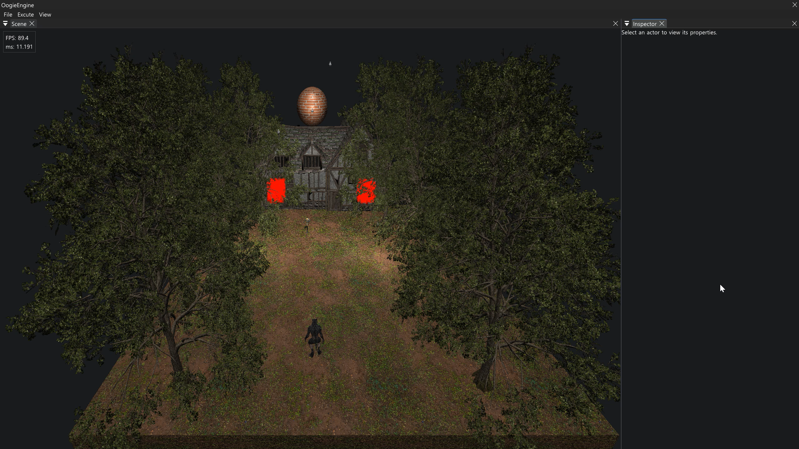
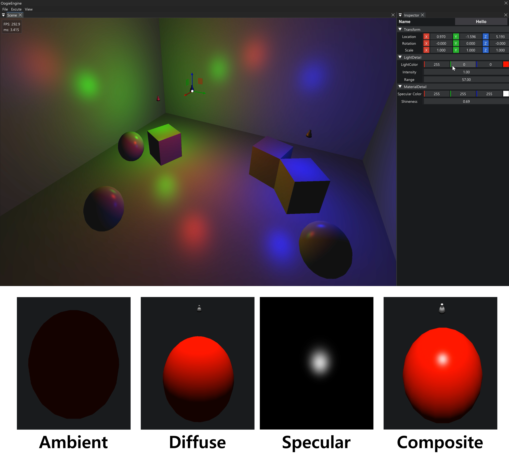
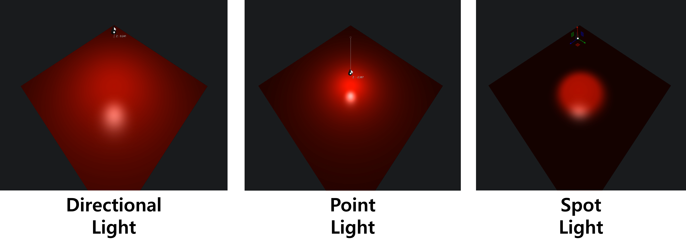
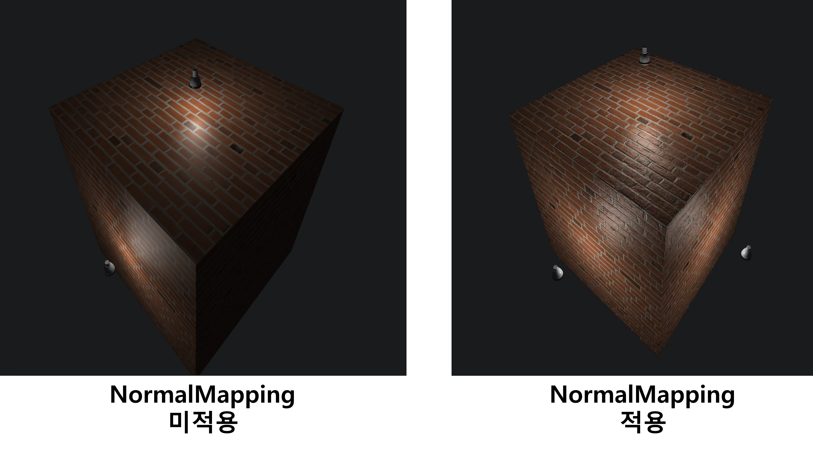

<h2>🧊 Oogie Engine - DirectX 11 3D Graphics Engine</h2>

  <!-- 아이콘과 제목을 한 줄에 배치 (아이콘은 링크 없음) -->
  <h3>
    
    OogieEngine Demo
  </h3>

  <!-- 메인 이미지에만 유튜브 링크 적용 -->
  
  
  
<i>이미지를 클릭하시면 유튜브 데모 영상으로 이동합니다.</i>

   
  본 프로젝트는 C/C++, DirectX 11 API를 활용하여 밑바닥부터 구축한 자체 렌더링 엔진입니다. 
  DirectX 11 그래픽스 파이프라인의 이해와 실시간 렌더링 최적화 구현을 목표로 제작하였습니다.

<!-- 기술스택 -->

  

 
 

## 🚀 구현 기능

<h3>Phong Lighting Model</h3>
<a href="https://youtu.be/rJZyKoF25bI?si=FcFMhCy3lkkyujJN" target="_blank">
  <!-- 유튜브 썸네일 이미지를 자동으로 가져오는 링크입니다 -->
  
</a>

<i>이미지를 클릭하시면 유튜브 데모 영상으로 이동합니다.</i>

3D 객체의 입체감과 재질(Material)의 특성을 사실적으로 렌더링하기 위해 Phong Lighting Model을 구현했습니다. 픽셀 셰이더(Pixel Shader) 내에서 환경광(Ambient), 난반사(Diffuse), 정반사(Specular) 요소를 각각 연산한 후 합성(Sum)하여 실시간 조명 효과를 표현하였습니다.  

<b>Ambient (환경광):</b> 빛이 직접 닿지 않는 표면에 기본적인 물체의 색상을 채워줍니다. 
<b>Diffuse (난반사):</b> 빛의 방향과 물체의 표면 법선벡터에 따른 명암을 계산하여 모델에 입체감을 불어줍니다. 
<b>Specular (정반사):</b> 카메라의 시선과 빛의 반사각을 계산하여 표면의 매끄러움 광택(하이라이트)을 표현 합니다. 

 
 

<h3>3-Types of Lighting</h3>
<a href="https://youtu.be/rrb3zLuQAUc?si=fQz-VYsuA7Tkkxkr" target="_blank">
  <!-- 유튜브 썸네일 이미지를 자동으로 가져오는 링크입니다 -->
  
</a>

<i>이미지를 클릭하시면 유튜브 데모 영상으로 이동합니다.</i>

씬(Scene)의 다채로운 시각적 연출을 위해 Phong Lighting Model 기반의 3가지 광원(Light) 모델을 구현했습니다. 
각 광원은 픽셀쉐이더(PixelShader)에서 빛의 방향, 위치, 그리고 거리에 따른 감쇠(Attenuation)를 개별적으로 연산하여 물리적으로 자연스러운 조명 효과를 생성합니다.
  

<b>Directional Light (방향광):</b> 태양광처럼 매우 먼 곳에서 비추어 씬 전체에 평행하게 들어오는 빛입니다. 위치 정보 없이 <b>방향(Direction)</b>만 존재하며, 거리에 따른 빛의 감쇠가 발생하지 않아 야외 환경의 기본적인 조명으로 사용됩니다.  
<b>Point Light (점광):</b> 전구나 횃불처럼 <b>특정 위치(Position)</b>에서 사방(360도)으로 뻗어나가는 빛입니다. 광원으로부터 거리가 멀어질수록 빛의 강도가 약해지는 <b>거리 감쇠(Distance Attenuation)</b> 공식을 적용하여 사실적인 공간감을 부여합니다. 
<b>Spot Light (원뿔광):</b> 손전등이나 무대 조명처럼 특정 위치에서 한 방향의 원뿔(Cone) 형태로 발산되는 빛입니다. 거리 감쇠뿐만 아니라, 빛의 중심(Inner Cone)에서 외곽(Outer Cone)으로 갈수록 어두워지는 <b>각도 감쇠(Angular Attenuation)</b> 연산을 통해 부드러운 조명 경계를 표현합니다. 

 
 

<h3>Normal Mapping</h3>
<a href="https://youtu.be/3sw58l2sdk8?si=QaNWqq_ZmF8KxqHV" target="_blank">
  <!-- 유튜브 썸네일 이미지를 자동으로 가져오는 링크입니다 -->
  
</a>

<i>이미지를 클릭하시면 유튜브 데모 영상으로 이동합니다.</i>

  저폴리곤(Low-Poly) 모델에서도 표면의 미세한 굴곡과 질감을 고해상도로 표현하기 위해 <b>Normal Mapping (법선 매핑)</b> 기법을 구현하였습니다.  
  실제 정점(Vertex)을 늘리지 않고 텍스처 데이터만으로 입체적인 조명 효과를 도출하여, 렌더링 퍼포먼스 최적화와 시각적 디테일을 동시에 확보했습니다.
  

<b>Directional Light (방향광):</b> 태양광처럼 매우 먼 곳에서 비추어 씬 전체에 평행하게 들어오는 빛입니다. 위치 정보 없이 <b>방향(Direction)</b>만 존재하며, 거리에 따른 빛의 감쇠가 발생하지 않아 야외 환경의 기본적인 조명으로 사용됩니다.  
<b>Point Light (점광):</b> 전구나 횃불처럼 <b>특정 위치(Position)</b>에서 사방(360도)으로 뻗어나가는 빛입니다. 광원으로부터 거리가 멀어질수록 빛의 강도가 약해지는 <b>거리 감쇠(Distance Attenuation)</b> 공식을 적용하여 사실적인 공간감을 부여합니다. 
<b>Spot Light (원뿔광):</b> 손전등이나 무대 조명처럼 특정 위치에서 한 방향의 원뿔(Cone) 형태로 발산되는 빛입니다. 거리 감쇠뿐만 아니라, 빛의 중심(Inner Cone)에서 외곽(Outer Cone)으로 갈수록 어두워지는 <b>각도 감쇠(Angular Attenuation)</b> 연산을 통해 부드러운 조명 경계를 표현합니다. 

 
 

### FBX Model Rendering
  
   
Autodesk FBX SDK를 엔진에 통합하여, 복잡한 3D 모델 데이터를 파싱(Parsing)하고 엔진의 자체적인 데이터 구조에 맞게 최적화하는 리소스 파이프라인을 구축했습니다.  
  모델의 특성과 애니메이션 여부에 따라 <b>StaticMesh</b>와 <b>SkeletalMesh</b>로 렌더링 로직을 분리하였습니다.
  

<b>StaticMesh:</b> 애니메이션 뼈대(Bone)가 없는 지형, 건물, 프랍(Prop) 등의 고정된 모델을 렌더링합니다. FBX 파일로부터 정점(Position, Normal, Tangent, UV)과 인덱스 데이터를 추출하여 DX11의 버퍼(Vertex/Index Buffer)로 변환하며, 모델 내의 여러 서브 메시(Sub-Mesh)와 다중 머티리얼을 계층적으로 분리하여 드로우 콜(Draw Call)을 효율적으로 관리하였습니다.
  
<b>SkeletalMesh:</b> 캐릭터나 몬스터처럼 뼈대 계층 구조(Bone Hierarchy)와 애니메이션 데이터를 갖는 복잡한 모델을 렌더링합니다. 각 정점에 영향을 미치는 뼈대의 가중치(Blend Weights/Indices)를 파싱하고, 매 프레임 업데이트되는 뼈대의 변환 행렬(Matrix Palette)을 GPU에 전달하여 CPU에서의 병목이 일어나지 않도록 구현하였습니다.

  

### Skinning Animation
  
   
Autodesk FBX SDK를 통해 추출한 애니메이션 키프레임(Keyframe) 데이터를 기반으로, SkeletalMesh에 Skinning Animation을 구현하였습니다.
  
  

### Particle
  
   
연기, 불꽃, 폭발 등의 화려한 시각 효과(VFX)를 실시간으로 처리하기 위해, 연산 부하를 CPU에서 GPU로 분산시킨 <b>GPU-Driven 파티클 시스템</b>을 구축했습니다.  
  Compute Shader에서 입자의 위치를 계산한 후 렌더링 파이프라인을 연계하여 수만 개의 파티클을 시뮬레이션합니다.
  
  

### Object Picking
  
   
3D 월드 공간의 객체를 마우스로 정밀하게 선택하고 상호작용하기 위해 <b>Object Picking (객체 픽킹)</b> 기능을 구현했습니다.  
  특히 수많은 폴리곤으로 이루어진 모델의 교차 연산 부하를 최소화하기 위해 <b>2단계 충돌 검사 알고리즘</b>으로 최적화를 하였습니다.
  

<b>1차 검증 (Bounding Volume 충돌):</b> 모델을 구성하는 모든 폴리곤을 검사하는 낭비를 막기 위해, 객체를 감싸는 경계 볼륨(AABB, OBB 또는 Bounding Sphere)과 광선의 충돌을 먼저 판별합니다.
  
<b>2차 검증 (선과 삼각형 충돌):</b> 1차 검증을 통과한 객체에 한해, 메시(Mesh)를 구성하는 실제 삼각형 정점들과 광선의 교차 여부를 판별합니다. 이를 통해 마우스가 클릭한 정확한 교차 지점과 거리를 계산하여 가려진 객체들을 판별하고 가장 가까운 객체를 선택합니다.

  

## 🚀 렌더링 최적화

  
    
  다중 광원(Light) 환경에서 발생하는 심각한 성능 저하를 해결하기 위해, 렌더링 파이프라인을 <b>Forward Rendering</b>에서 <b>Deferred Rendering(지연 렌더링)</b> 구조로 전면 개편했습니다.  
  그 결과 연산 복잡도를 획기적으로 낮추고 프레임 속도를 <b>약 6.4배(638%)</b> 향상시켰습니다.

 

#### 🚨 기존 방식의 한계 (Forward Rendering)
* 초기 엔진은 씬(Scene) 내의 모든 광원이 전체 오브젝트에 대해 각각 조명 연산을 수행하는 구조였습니다.
* 이로 인해 연산 복잡도가 <code>O(라이트 개수 × 오브젝트 개수)</code>로 기하급수적으로 증가하여, 씬이 복잡해지고 동적 광원이 추가될수록 프레임이 급격히 저하되는 병목(Bottleneck) 현상이 발생했습니다.

#### 💡 해결 방안 (Deferred Rendering 방식 도입)
* 무거운 조명 연산을 나중으로 미루기 위해 씬의 기하학적 정보(Albedo, Normal, Specular, Position)를 먼저 <b>G-Buffer(Geometry Buffer)</b>에 렌더링하여 저장했습니다.
* 이후 화면에 렌더링되는 픽셀(Pixel)들에 대해서만 저장된 G-Buffer 데이터를 바탕으로 단 한 번의 최종 조명 연산(Lighting Pass)을 수행하도록 구조를 최적화했습니다.

#### 📈 최적화 결과
* 연산 복잡도를 <code>O(라이트 개수 × 픽셀 수)</code>로 대폭 낮추어 광원 추가에 대한 연산 부담을 최소화했습니다.
  
    
  

  

