

<h2>🧊 OogieEngine - DirectX 11 3D Graphics Engine</h2>

  <h3>
    
    OogieEngine Demo
  </h3>

  <a href="https://youtu.be/Kpxutf8pM94?si=MlyB8zDna2TBQk3L" target="_blank">
    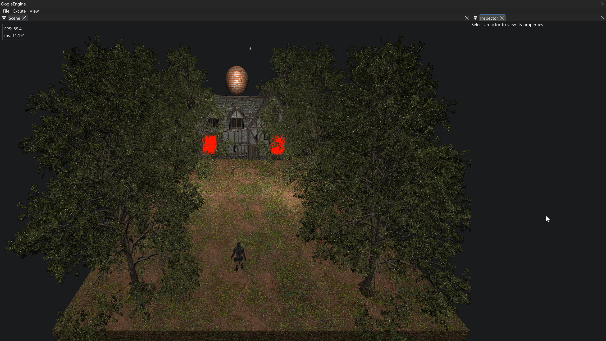
  </a>

  
<i>이미지를 클릭하시면 유튜브 데모 영상으로 이동합니다.</i>

   
  상용 엔진 없이 C++와 DirectX 11 API로 직접 구축한 3D 렌더링 엔진입니다. 
  그래픽스 파이프라인 이해, 메모리 직접 제어, 실시간 렌더링 최적화를 목표로 제작했습니다. 
  Deferred Rendering을 도입해 라이트 100개 · 오브젝트 200개 기준 <b>5.40 FPS → 34.5 FPS</b>로 성능을 개선했습니다. 

<!-- 기술스택 -->

  

 

  <b>Team Size</b> : 개인 프로젝트 &nbsp;|&nbsp; <b>Dev Period</b> : 2025.09 ~ 2026.04

 
 

## 🚀 구현 기능

#### 🛠️ 구현 - Phong Lighting Model
* 3D 객체의 입체감과 재질(Material)의 특성을 표현하기 위해 Phong Lighting Model을 구현했습니다.
* 픽셀 셰이더에서 Ambient, Diffuse, Specular를 각각 계산한 뒤 합산해 조명을 표현했습니다.
  * <b>Ambient (환경광)</b> : 빛이 직접 닿지 않는 표면에 기본 색상을 채웁니다.
  * <b>Diffuse (난반사)</b> : 빛의 방향과 표면 법선 벡터로 명암을 계산해 입체감을 표현합니다.
  * <b>Specular (정반사)</b> : 카메라 시선과 빛의 반사각으로 표면의 하이라이트를 표현합니다.

  <h3>
    
    Phong Lighting Model
  </h3>

  <a href="https://youtu.be/rJZyKoF25bI?si=GVgNsQhXlgkBmETR" target="_blank">
    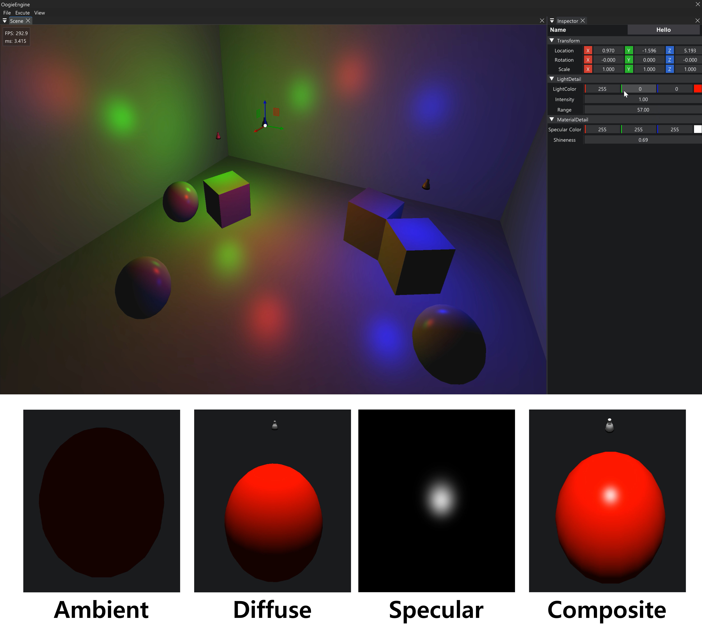
  </a>

  
<i>이미지를 클릭하시면 유튜브 데모 영상으로 이동합니다.</i>

 

#### 🛠️ 구현 - 3-Types of Lights
* Phong Lighting Model을 기반으로 3가지 광원을 구현했습니다.
* 각 광원은 픽셀 셰이더에서 빛의 방향, 위치, 거리에 따른 감쇠(Attenuation)를 개별적으로 계산합니다.
  * <b>Directional Light (방향광)</b> : 태양광처럼 먼 곳에서 씬 전체에 평행하게 들어오는 빛입니다. 위치 없이 <b>방향</b>만 가지며, 거리에 따른 감쇠가 없어 야외 환경의 기본 조명으로 사용됩니다.
  * <b>Point Light (점광)</b> : 전구나 횃불처럼 <b>특정 위치</b>에서 사방으로 퍼지는 빛입니다. 거리가 멀어질수록 빛이 약해지는 <b>거리 감쇠</b>를 적용했습니다.
  * <b>Spot Light (원뿔광)</b> : 손전등이나 무대 조명처럼 원뿔 형태로 퍼지는 빛입니다. 거리 감쇠와 함께, 중심(Inner Cone)에서 외곽(Outer Cone)으로 갈수록 어두워지는 <b>각도 감쇠</b>를 적용해 조명 경계를 부드럽게 표현했습니다.

  <h3>
    
    3-Types of Lights
  </h3>

  <a href="https://youtu.be/rrb3zLuQAUc?si=AY_YGzcbbE6DpYi5" target="_blank">
    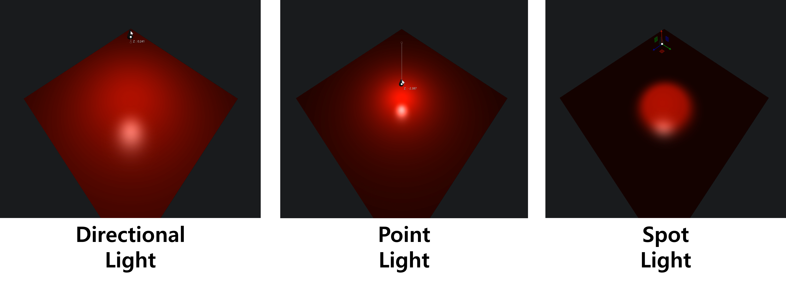
  </a>

  
<i>이미지를 클릭하시면 유튜브 데모 영상으로 이동합니다.</i>

 

#### 🛠️ 구현 - Normal Mapping
* 저폴리곤(Low-Poly) 모델에서도 표면의 굴곡과 질감을 표현하기 위해 <b>Normal Mapping</b>을 구현했습니다.
* 정점을 늘리지 않고 텍스처 데이터만으로 조명 효과를 계산해, 렌더링 비용을 늘리지 않으면서 시각적 디테일을 표현했습니다.

  <h3>
    
    Normal Mapping
  </h3>

  <a href="https://youtu.be/3sw58l2sdk8?si=iRwrZKF_xc-vEJps" target="_blank">
    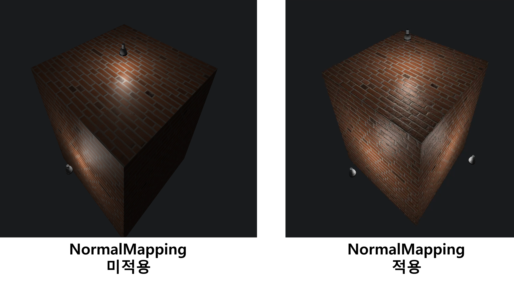
  </a>

  
<i>이미지를 클릭하시면 유튜브 데모 영상으로 이동합니다.</i>

  

---

## ⚡ 렌더링 최적화 - Deferred Rendering

#### 🚨 문제 상황 - Forward Rendering의 한계
* 초기 엔진은 Forward Rendering 방식으로, 씬의 모든 라이트가 전체 오브젝트에 대해 각각 조명 연산을 수행했습니다.
* 이로 인해 연산 복잡도가 <b>O(라이트 개수 × 오브젝트 개수)</b>가 되어, 광원과 오브젝트가 늘어날수록 프레임이 크게 떨어졌습니다.
* 라이트 100개, 오브젝트 200개 기준 <b>5.40 FPS (185.19 ms)</b>

  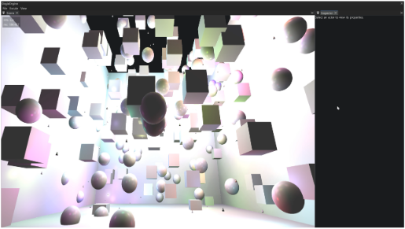
  
<i>Forward Rendering - 5.40 FPS / 185.19 ms</i>

 

#### 💡 해결 방안 - Deferred Rendering 도입
* 무거운 조명 연산을 뒤로 미루기 위해, 씬의 기하학적 정보(Albedo, Normal, Specular, Position)를 먼저 <b>G-Buffer(Geometry Buffer)</b>에 저장했습니다.
* 이후 G-Buffer를 바탕으로 화면 픽셀에 대해서만 조명 연산(Lighting Pass)을 수행하도록 렌더링 파이프라인을 바꿨습니다.

  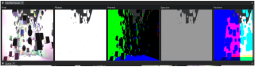
  
<i>G-Buffer [Albedo, Normal, Specular, Position]</i>

   
  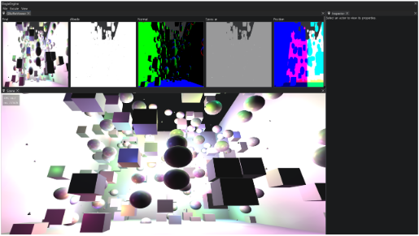
  
<i>Deferred Rendering - 34.5 FPS / 28.99 ms</i>

   
  <h3>
    
    Deferred Rendering
  </h3>
  <a href="https://youtu.be/_483N6uNDJI?si=-5SzA2ITyNGqqWEy" target="_blank">
    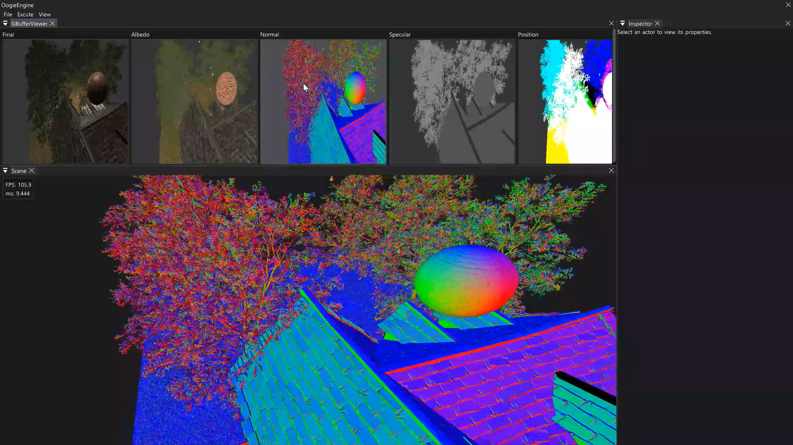
  </a>
  
<i>이미지를 클릭하시면 유튜브 데모 영상으로 이동합니다.</i>

 

#### 📈 결과
* 연산 복잡도를 <b>O(라이트 개수 × 오브젝트 개수) → O(라이트 개수 × 픽셀 수)</b>로 낮춰, 광원 추가에 따른 연산 부담을 줄였습니다.
* 라이트 100개, 오브젝트 200개 기준 <b>5.40 FPS → 34.5 FPS로 약 6.4배</b> 개선했습니다.

  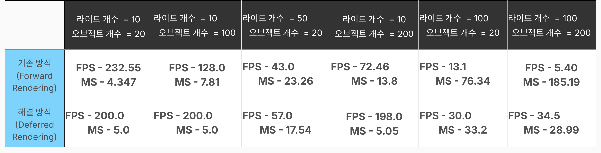
    
  <h3>
    
    Forward Rendering vs Deferred Rendering 성능 비교
  </h3>
  <a href="https://youtu.be/teSDr41GZgU?si=dFrPl5olK_v8kCty" target="_blank">
    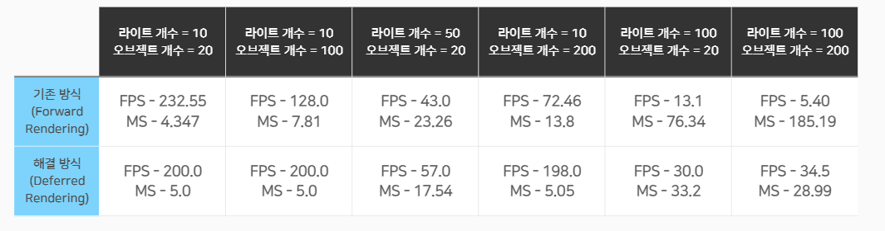
  </a>
  
<i>이미지를 클릭하시면 프레임 성능 비교 영상으로 이동합니다.</i>

  

---

## 📦 FBX Model Rendering

#### 🛠️ 구현 - FBX 리소스 파이프라인
* Autodesk FBX SDK를 엔진에 통합해, 3D 모델 데이터를 파싱하고 엔진의 데이터 구조에 맞게 변환하는 리소스 파이프라인을 구축했습니다.
* 모델의 특성과 애니메이션 여부에 따라 <b>StaticMesh</b>와 <b>SkeletalMesh</b>로 렌더링 로직을 분리했습니다.
  * <b>StaticMesh</b> : 뼈대(Bone)가 없는 지형, 건물, 프랍(Prop) 등 고정된 모델을 렌더링합니다. FBX에서 정점(Position, Normal, Tangent, UV)과 인덱스 데이터를 추출해 Vertex/Index Buffer로 변환하고, 서브 메시(Sub-Mesh)와 다중 머티리얼을 분리해 드로우 콜(Draw Call)을 관리했습니다.
  * <b>SkeletalMesh</b> : 캐릭터처럼 뼈대 계층 구조(Bone Hierarchy)와 애니메이션 데이터를 갖는 모델을 렌더링합니다. 각 정점에 영향을 주는 뼈대 가중치(Blend Weights/Indices)를 파싱하고, 매 프레임 갱신되는 뼈대 변환 행렬(Matrix Palette)을 GPU로 전달해 CPU 병목이 생기지 않도록 했습니다.

  <h3>
    
    FBX Model Rendering
  </h3>

  <a href="https://youtu.be/9XO9NmMlOsQ?si=h2de-xmlyedLvgIY" target="_blank">
    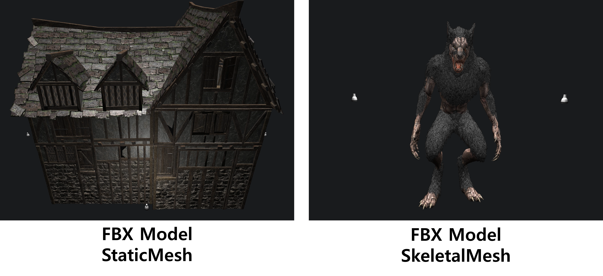
  </a>

  
<i>이미지를 클릭하시면 유튜브 데모 영상으로 이동합니다.</i>

 

#### 📐 배경 - Control Point와 정점 분할
* FBX 파일은 위치 좌표(x, y, z)만 가진 <b>Control Point</b>로 모델을 저장합니다. 예를 들어 정육면체는 8개의 Control Point를 가집니다.
* 하나의 Control Point를 여러 면이 공유해도, 면의 방향에 따라 법선(Normal)과 텍스처 좌표(UV)가 다를 수 있습니다.
* 따라서 Control Point를 렌더링용 정점(Vertex)으로 분할해 다시 구성해야 합니다.

  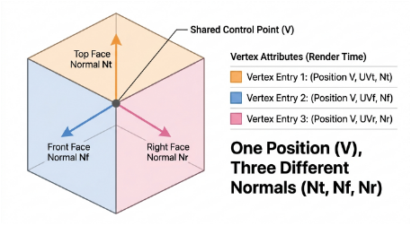

 

#### 🚨 문제 상황 - 정점 데이터 중복
* 초기에는 폴리곤을 순회하며 정점을 배열에 그대로 추가했습니다.
* 이 방식은 <b>면과 면이 공유하는 동일한 정점이 중복으로 저장</b>되어, 메모리 낭비와 렌더링 부하가 발생했습니다.

  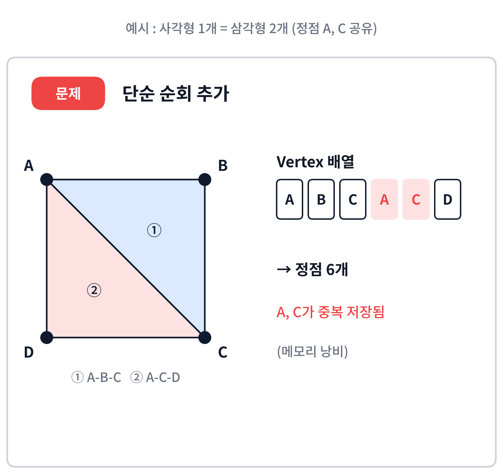

 

#### 💡 해결 방안 - 해시맵 기반 정점 캐싱(Vertex Caching)
* 조립이 끝난 정점 구조체를 Key로 사용하는 <b>std::unordered_map 기반 정점 캐싱</b>을 구현했습니다.
* 새 정점이 들어오면 캐시를 먼저 검색해, <b>이미 있는 정점은 새로 추가하지 않고 기존 Index만 추가</b>하도록 했습니다.

  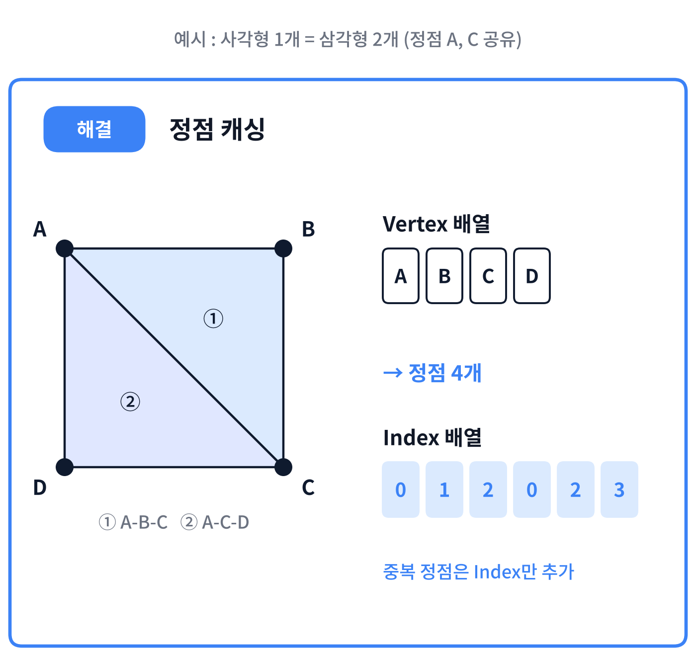
    
  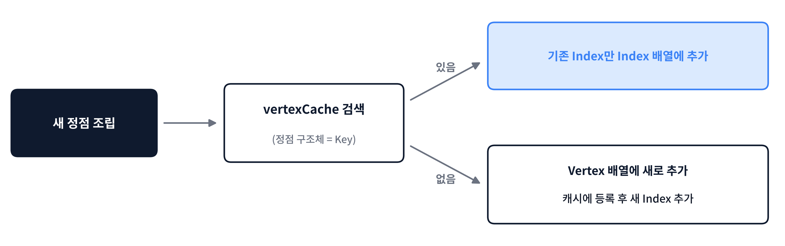

 

#### 🛠️ 구현 - Skinning Animation
* FBX SDK로 추출한 애니메이션 키프레임(Keyframe) 데이터를 기반으로, SkeletalMesh에 <b>Skinning Animation</b>을 구현했습니다.

  <h3>
    
    SkeletalMesh & Skinning Animation
  </h3>

  <a href="https://youtu.be/Izbu4-qaoKI?si=sI-ZbrywC38-T72S" target="_blank">
    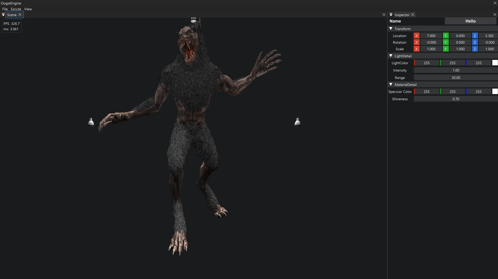
  </a>

  
<i>이미지를 클릭하시면 유튜브 데모 영상으로 이동합니다.</i>

  

---

## ✨ Particle

#### 🛠️ 구현 - GPU-Driven 파티클 시스템
* 연기, 불꽃, 폭발 같은 시각 효과(VFX)를 실시간으로 처리하기 위해, 연산 부하를 CPU에서 GPU로 옮긴 <b>GPU-Driven 파티클 시스템</b>을 구축했습니다.
* Compute Shader에서 입자의 위치를 계산한 뒤 렌더링 파이프라인과 연결해, 수만 개의 파티클을 시뮬레이션합니다.

  

  

---

## 🎯 Object Picking

#### 🛠️ 구현 - Object Picking
* 3D 공간의 오브젝트를 마우스로 선택하기 위해 Object Picking을 구현했습니다.
* 마우스 클릭 좌표를 기반으로 3D 공간에 광선(Ray)을 발사하고, Ray와 충돌한 오브젝트 중 <b>가장 가까운 오브젝트를 선택</b>합니다.

  <h3>
    
    Object Picking
  </h3>

  <a href="https://youtu.be/EG2wk8ieWFA?si=MDvIV4XiFGQUowOB" target="_blank">
    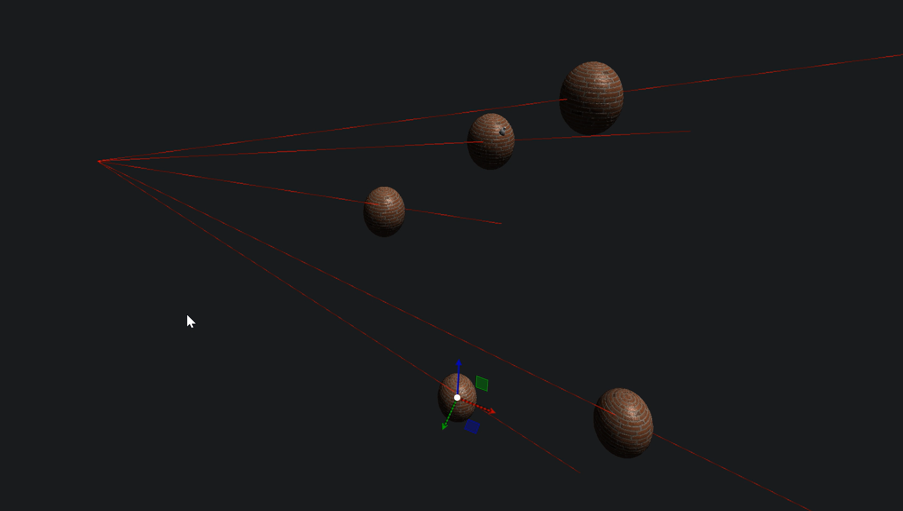
  </a>

  
<i>이미지를 클릭하시면 유튜브 데모 영상으로 이동합니다.</i>

   
  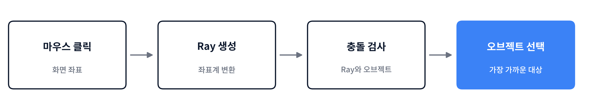

 

#### 🛠️ 구현 - 좌표계 변환을 통한 Ray 생성
* 마우스 좌표로 만든 Ray는 Clip 공간에 있으므로, 오브젝트가 있는 공간으로 변환해야 합니다.
* Ray에 <b>Projection, View, World 행렬의 역행렬을 차례로 곱해 Object 공간으로 변환</b>한 뒤 충돌 검사를 수행했습니다.

  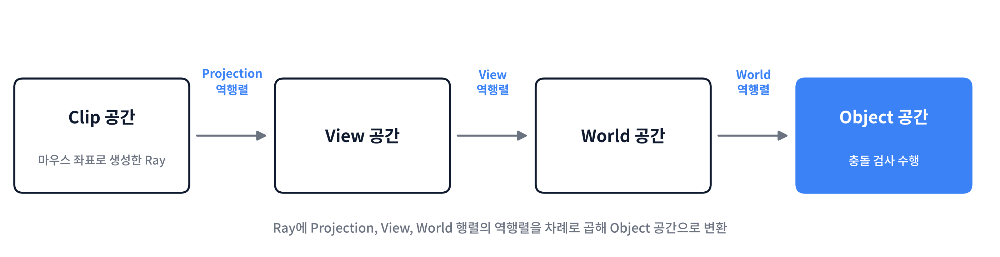
    
  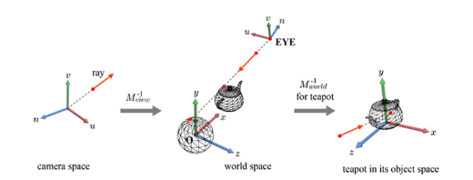

 

#### 🛠️ 최적화 - World 공간이 아닌 Object 공간에서 충돌 검사
* World 공간에서 검사하면, Phase 2 삼각형 단위 검사 시 <b>메쉬의 모든 정점을 World 공간으로 변환</b>해야 합니다.
* 반대로 <b>Ray 하나만 Object 공간으로 변환</b>하면 정점은 변환하지 않아도 되어, 불필요한 연산이 줄어듭니다.
* 변환 횟수 : 정점 N번 → <b>Ray 1번</b>

  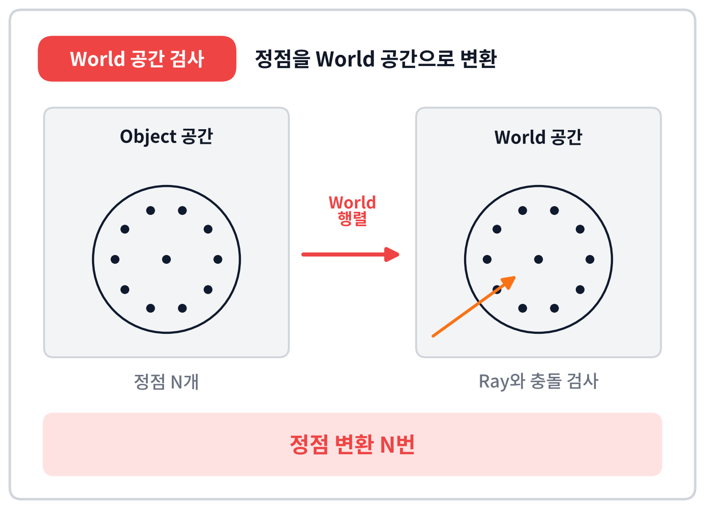
  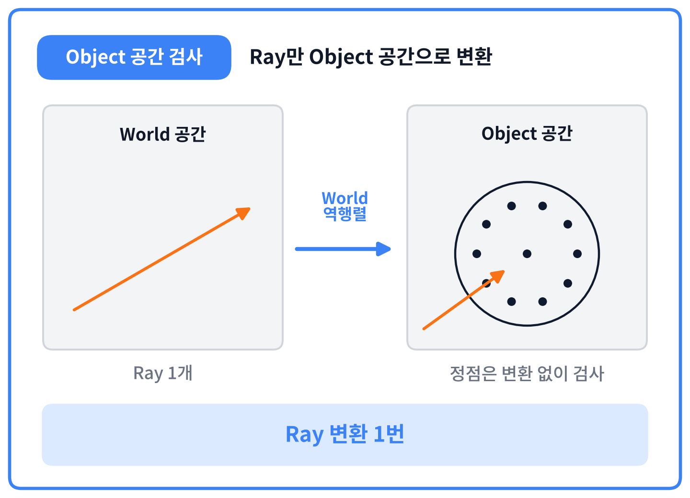

 

#### 🛠️ 최적화 - 2-Phase 충돌 검사 (불필요한 연산↓ 정밀도↑)
* <b>Phase 1 - AABB 검사</b> : 모든 폴리곤을 검사하는 낭비를 막기 위해, 연산 비용이 낮은 AABB 검사를 먼저 수행해 Ray가 박스를 통과하지 않는 오브젝트를 빠르게 제외했습니다.
* <b>Phase 2 - 삼각형 단위 정밀 검사</b> : Phase 1을 통과한 후보만 실제 메쉬의 삼각형 단위로 Ray와의 교차 여부를 검사합니다. 교차 지점과 거리를 계산해 가려진 오브젝트를 걸러내고, 가장 가까운 오브젝트를 선택합니다.

  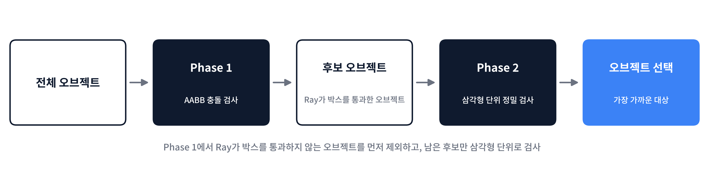
    
  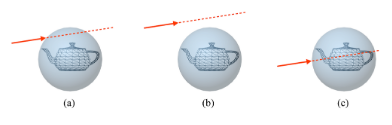
  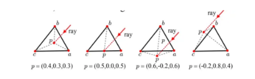
  
<i>Phase 1 - AABB 충돌 / Phase 2 - 삼각형 단위 충돌</i>

  

---

## 🐞 Debug Renderer - Ray 시각화

#### 🚨 도입 배경
* 3D 공간의 Ray나 충돌 영역은 화면에 보이지 않아, 로직이 맞는지 확인하거나 오류를 추적하는 데 시간이 많이 들었습니다.
* 개발 중에 바로 눈으로 확인할 수 있는 디버그 환경이 필요했습니다.

#### 💡 해결 - Debug Ray 시각화
* 계산된 Ray의 3D 궤적을 화면에 <b>선(Line)으로 렌더링</b>하는 디버그 기능을 추가했습니다.
* 테스트 중 언제든 <b>Ray의 위치와 방향을 눈으로 확인</b>할 수 있도록 했습니다.

  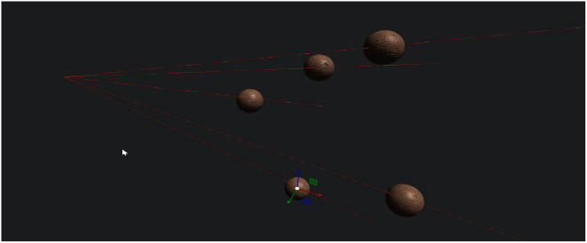
  
<i>Debugging을 위한 Line Rendering</i>

#### 📝 성과 및 배운 점
* 머릿속으로 계산하던 공간 변환 결과를 화면으로 확인할 수 있게 되어, 논리 오류를 더 빠르게 찾고 고칠 수 있었습니다.
* 이전에는 사용자에게 보이는 결과물 구현에만 집중했지만, 이 작업을 통해 <b>개발자를 위한 테스트 도구와 디버깅 환경도 핵심 기능만큼 중요하다</b>는 것을 알게 되었습니다.

  

---

## 📝 회고

#### 1. 설계의 중요성
* 렌더러, 엔진, 클라이언트를 구현하면서 처음에는 설계보다 기능 구현을 우선했습니다.
* 그 결과 개발이 진행될수록 구조가 꼬였고, 이를 바로잡기 위한 리팩토링에 많은 시간을 쓰게 되었습니다.
* 처음 엔진을 만들어 보는 단계에서는 앞으로 어떤 문제가 생길지 예측하기 어려워 기능을 먼저 구현했지만, 어느 정도 구조를 그릴 수 있는 단계에서는 <b>초반 설계에 시간을 들이는 것이 전체 개발 시간을 줄인다</b>는 것을 배웠습니다.

#### 2. 디버깅 도구의 중요성
* 런타임 이슈를 디버깅하며, 동작하는 코드를 넘어 <b>문제의 원인을 추적할 수 있는 도구를 갖추는 것도 개발 역량</b>이라는 것을 배웠습니다.

  
